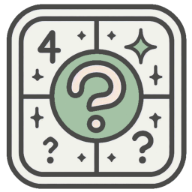

# wichat_en1a

Welcome to WiChat!

This is a web service where you log in and can play several trivial-style games, and your score is saved, like a social network of sorts.
The application is expected to feature four different game modes, a custom one, an ai chat in all of them and many more exciting features!

## Information about the project
This project comes from a template to ease our development as we had never used any of these technologies, except the javascript languaje itself.
- For any documentation regarding our workflow or how to deploy this application for yourself, refer to our [wiki](https://github.com/Arquisoft/wichat_en1a/wiki).
- For any doubts regarding a more in depth look into our implementation, look into our [documentation](https://arquisoft.github.io/wichat_en1a/).

## Errors and bugs
If while using this application, at any point you encounter any bug, feel free to add a new issue on the github tab to notify us about the problem.
Remember to add an appropiate label and type, and an extensive description if possible explaining the issue found to increase the chance of us replicating and fixing your issue.

Feel free to contact support privately via [signal](https://signal.me/#eu/-gnbaFEXeBNhNFGqMfudDoDDlm3wNsL8Lp9-wxskdujg7n359tNPd4hCf2Tyb5wC)

## Contributors
Contributor | Git Account | Contact Email
-- | -- | --
Miguel Álvarez Hernández |  | UO295368@uniovi.es
Marcos Losada García |  | UO295106@uniovi.es 
Javier Carrasco Arango |  | UO294532@uniovi.es
María Rodríguez Gómara|  | UO294039@uniovi.es
Vicente Megido García |  | UO294013@uniovi.es
